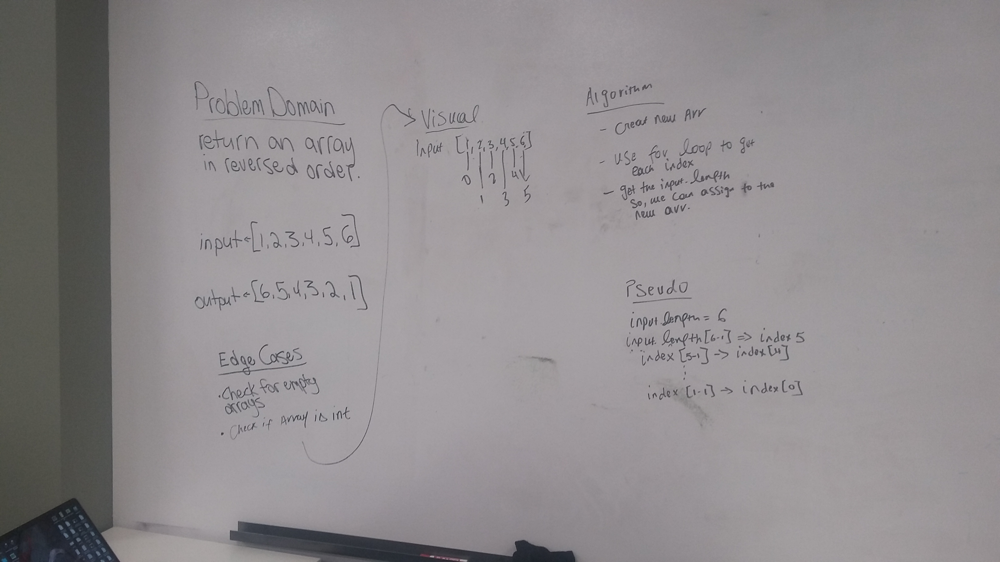
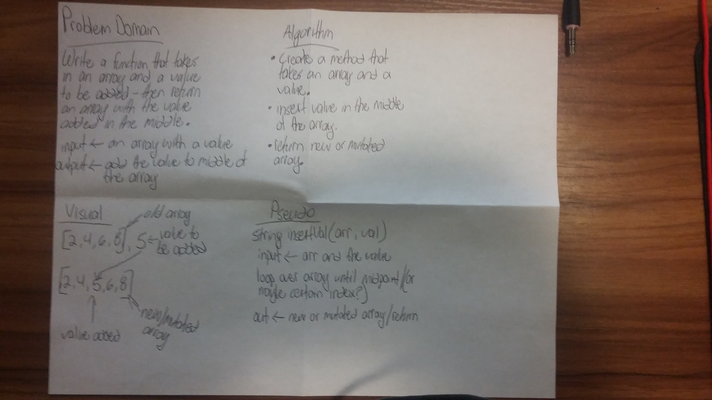
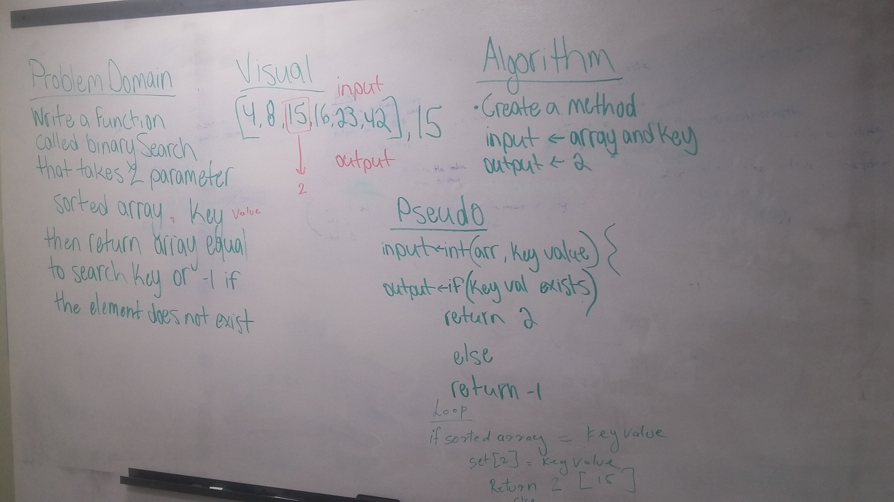

##data-structures-and-algorithms

## Table of Contents
1. Array Reverse
2. Array Shift
3. Binary Search

--------------------------------------------------------------

### 1. ReverseArray

#### Challenge
Write a function called reverseArray which takes an array as an argument. Without utilizing any of the built-in methods available to your language, return an array with elements in reversed order.

#### Approach & Efficiency
I knew I would need a for loop to iterate over the array. For Big 0, i still don't really understand it so I referred to: https://www.interviewcake.com/article/java/big-o-notation-time-and-space-complexity - should be O(1) - because it requires one step.

### Code
[Github](https://github.com/JBusch2010/data-structures-and-algorithms/blob/master/code401challenges/src/main/java/code401challenges/ArrayReverse.java)

### Contributions
- Roman
- https://www.baeldung.com/java-loops

#### Solution

--------------------------------------------------------------

### 2. ArrayShift

#### Challenge
Write a function called insertShiftArray which takes in an array and the value to be added. Without utilizing any of the built-in methods available to your language, return an array with the new value added at the middle index.

#### Approach & Efficiency
I knew I needed to create an array, insert the new value in the array at a certain index,and then return the array. I found and learned a way to obtain the solution to the problem.

Big O Notation
Time: O(n)
Space: O(n)

### Code
[Github](https://github.com/JBusch2010/data-structures-and-algorithms/blob/master/code401challenges/src/main/java/code401challenges/ArrayShift.java)

### Contributions
- Chris Coulon

#### Solution

--------------------------------------------------------------

### 3. BinarySearch

#### Challenge
Write a function called BinarySearch which takes in 2 parameters: a sorted array and the search key. Without utilizing any of the built-in methods available to your language, return the index of the array’s element that is equal to the search key, or -1 if the element does not exist.

#### Approach & Efficiency
Continue to check if the key is larger, smaller, or the same.  If the element does not exist the method will return -1;

Big O Notation
Time: O(log(n))
Space: O(1)

### Code
[Github](https://github.com/JBusch2010/data-structures-and-algorithms/blob/master/code401challenges/src/main/java/code401challenges/BinarySearch.java)

### Contributions
- Promila
- Fabion Brookes
- Chris Coulon
- http://www.java2novice.com/junit-examples/assert-equals/
-https://www.geeksforgeeks.org/binary-search/
-https://www.jetbrains.com/help/idea/create-tests.html

#### Solution
