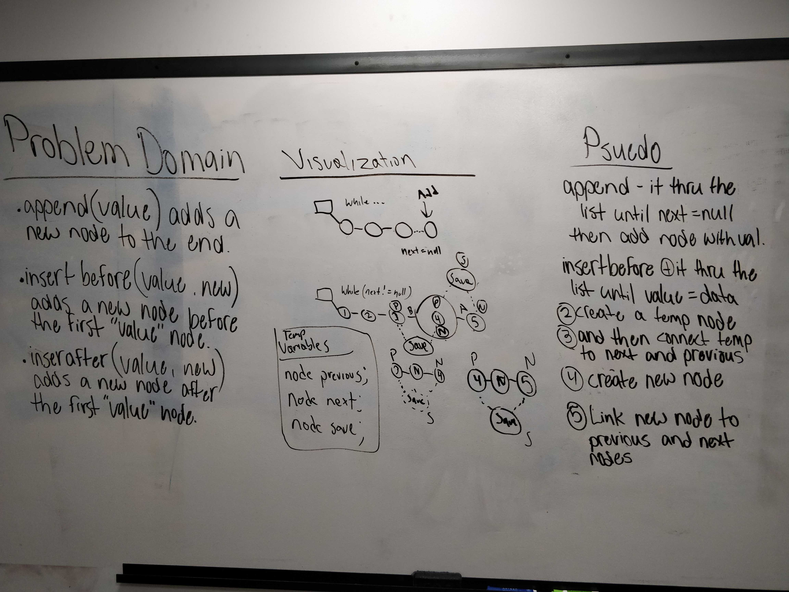
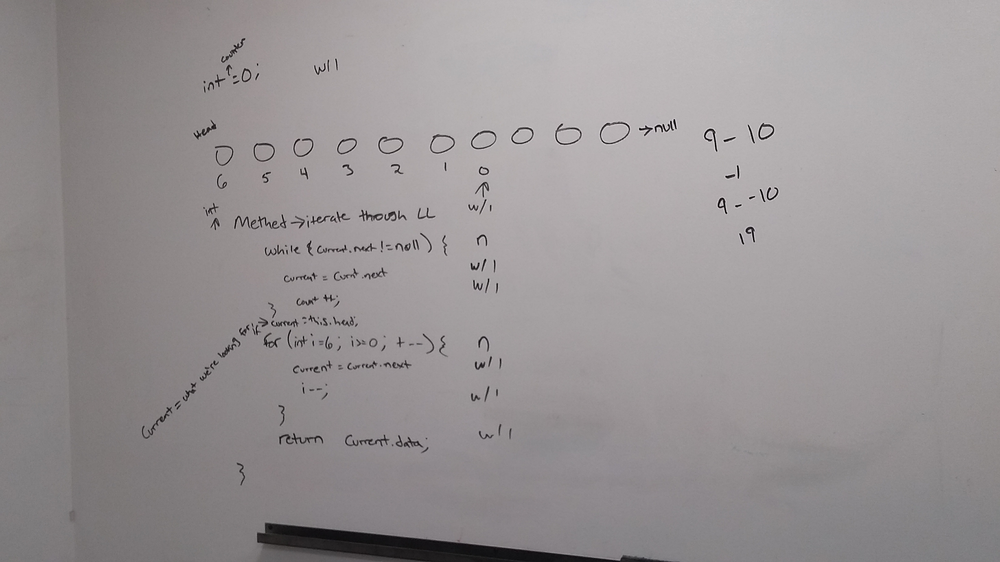
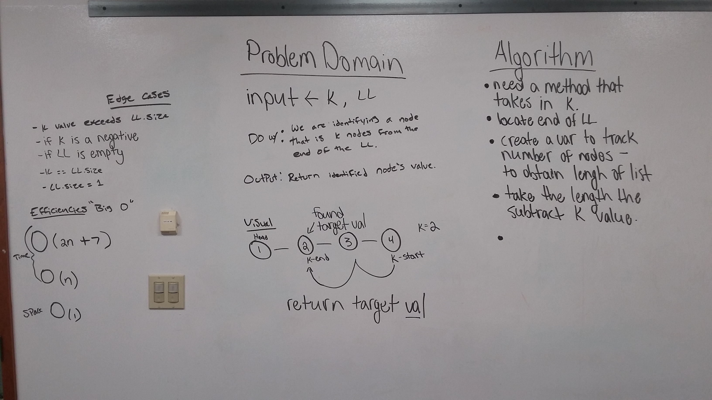
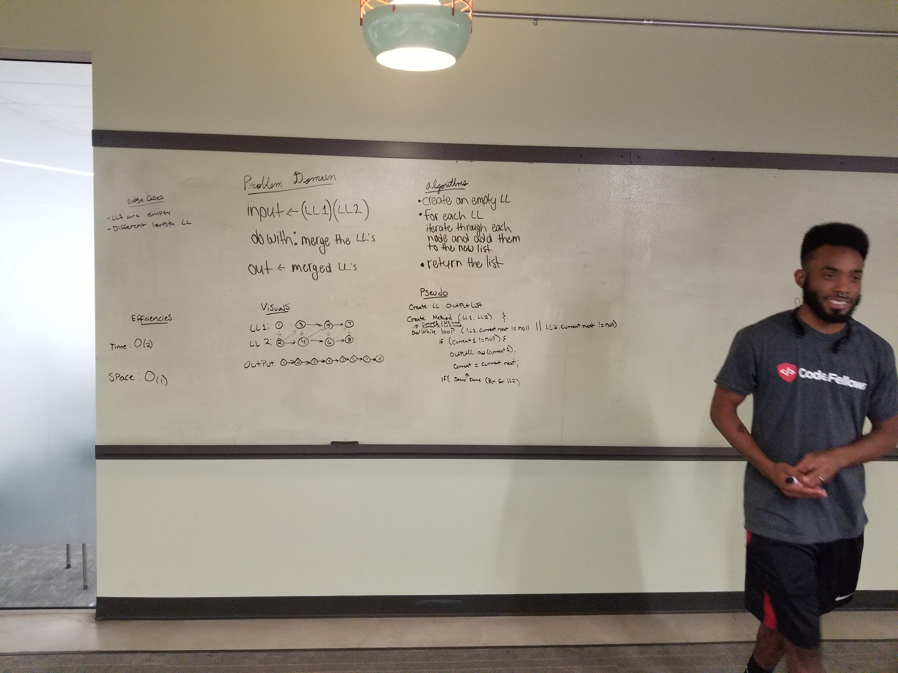
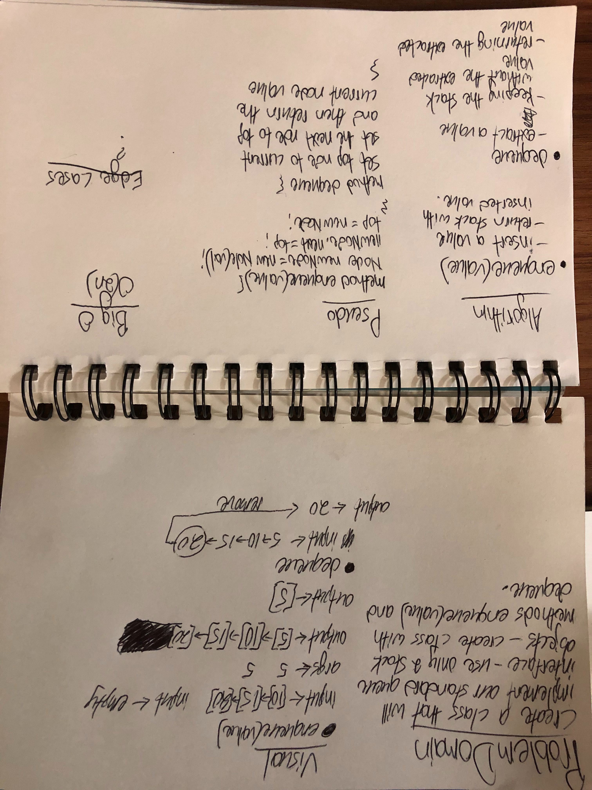

# Data-Structures-and-Algorithms

## Table of Contents
1. Array Reverse
2. Array Shift
3. Binary Search
4. Linked List
5. Linked List Append, InsertBefore, InsertAfter
6. Linked List K'th Node
7. Linked List Merge
8. Stacks and Queues
9. Pseudoqueue
10. Binary Tree and BST Implementation

--------------------------------------------------------------

### 1. ReverseArray

#### Challenge
Write a function called reverseArray which takes an array as an argument. Without utilizing any of the built-in methods available to your language, return an array with elements in reversed order.

#### Approach & Efficiency
I knew I would need a for loop to iterate over the array. For Big 0, i still don't really understand it so I referred to: https://www.interviewcake.com/article/java/big-o-notation-time-and-space-complexity - should be O(1) - because it requires one step.

### Code
[Github](https://github.com/JBusch2010/data-structures-and-algorithms/blob/master/code401challenges/src/main/java/code401challenges/ArrayReverse.java)

### Contributions
- Roman
- https://www.baeldung.com/java-loops

#### Solution

--------------------------------------------------------------

### 2. ArrayShift

#### Challenge
Write a function called insertShiftArray which takes in an array and the value to be added. Without utilizing any of the built-in methods available to your language, return an array with the new value added at the middle index.

#### Approach & Efficiency
I knew I needed to create an array, insert the new value in the array at a certain index,and then return the array. I found and learned a way to obtain the solution to the problem.

Big O Notation
Time: O(n)
Space: O(n)

### Code
[Github](https://github.com/JBusch2010/data-structures-and-algorithms/blob/master/code401challenges/src/main/java/code401challenges/ArrayShift.java)

### Contributions
- Chris Coulon

#### Solution

--------------------------------------------------------------

### 3. BinarySearch

#### Challenge
Write a function called BinarySearch which takes in 2 parameters: a sorted array and the search key. Without utilizing any of the built-in methods available to your language, return the index of the array’s element that is equal to the search key, or -1 if the element does not exist.

#### Approach & Efficiency
Continue to check if the key is larger, smaller, or the same.  If the element does not exist the method will return -1;

Big O Notation
Time: O(log(n))
Space: O(1)

### Code
[Github](https://github.com/JBusch2010/data-structures-and-algorithms/blob/master/code401challenges/src/main/java/code401challenges/BinarySearch.java)

### Contributions
- Promila
- Fabion Brookes
- Chris Coulon
- http://www.java2novice.com/junit-examples/assert-equals/
-https://www.geeksforgeeks.org/binary-search/
-https://www.jetbrains.com/help/idea/create-tests.html

#### Solution

--------------------------------------------------------------

### 4. Linked List

#### Challenge
Create a Node class that has properties for the value stored in the Node, and a pointer to the next Node.

#### Approach & Efficiency
Defined a methods I needed and made the constructor to create new lists

Big O Notation
Time: O(log(n))
Space: O(1)

### Code
[Github](https://github.com/JBusch2010/data-structures-and-algorithms/tree/master/linked_list)

### Contributions
- Fabion Brooks
- //https://www.geeksforgeeks.org/linked-list-set-1-introduction/
- https://stackoverflow.com/questions/6119392/junit-testing-for-a-boolean-method

--------------------------------------------------------------

### 5. Linked List Append, InsertBefore, InsertAfter

#### Challenge
Write methods that add a node at the end and before and after a selected node

#### Approach & Efficiency
For append - iterate through the list until next = null then add a val
For addbefore - it thru the list until node, create new node, link new node

Big O Notation
Time: O(log(n))
Space: O(1)

### Code
[Code](https://github.com/JBusch2010/data-structures-and-algorithms/blob/master/code401challenges/linked_list/src/main/java/linked_list/LinkedList.java)

[Tests](https://github.com/JBusch2010/data-structures-and-algorithms/blob/master/code401challenges/linked_list/src/test/java/linked_list/LinkedListTest.java)

### Contributions
- Fabion Brooks
- Jack Daniels
-Manish KC
- https://www.javatpoint.com/java-program-to-insert-a-new-node-at-the-end-of-the-singly-linked-list
- https://stackoverflow.com/questions/5236486/adding-items-to-end-of-linked-list

#### Solution

--------------------------------------------------------------

### 6. Linked List K'th Node

#### Challenge
Given a Linked List and a number k, write a method that returns the value at the k’th node from the end of the Linked List.

#### Approach & Efficiency
- Need a method that takes in k.
- identify the end of the list
- create a var that tracks the length of the list
- take the length and subtract k

Big O Notation
Time: O(n)
Space: O(1)

### Code
[Github](https://github.com/JBusch2010/data-structures-and-algorithms/blob/master/code401challenges/linked_list/src/main/java/linked_list/LinkedList.java)

### Contributions
- Fabion Brooks
- Chris Coulon
- https://www.javatpoint.com/java-program-to-insert-a-new-node-at-the-end-of-the-singly-linked-list
- https://stackoverflow.com/questions/5236486/adding-items-to-end-of-linked-list
- https://www.geeksforgeeks.org/nth-node-from-the-end-of-a-linked-list/

#### Solution

--------------------------------------------------------------

### 7. Linked List Merge

#### Challenge
Write a function called mergeLists which takes two linked lists as arguments. Zip the two linked lists together into one so that the nodes alternate between the two lists and return a reference to the head of the zipped list.

#### Approach & Efficiency
- create an empty LL
- for each LL iterate through each node and add them to new list
- return list

Big O Notation
Time: O(2)
Space: O(1)

### Code
[Github](https://github.com/JBusch2010/data-structures-and-algorithms/blob/master/code401challenges/linked_list/src/main/java/linked_list/LinkedList.java)

[Tests](https://github.com/JBusch2010/data-structures-and-algorithms/blob/master/code401challenges/linked_list/src/test/java/linked_list/LinkedListTest.java)

### Contributions
- Manish KC
- Chris Coulon

#### Solution

--------------------------------------------------------------

### 8. Stacks and Queues

#### Challenge
Create node, stack, and queue classes and create methods for them to pop and push nodes.

Big O Notation
Time: O(1)
Space: O(1)

### Code
[Github](https://github.com/JBusch2010/data-structures-and-algorithms/tree/master/code401challenges/stacksandqueues/src/main/java/stacksandqueues)

[Tests](https://github.com/JBusch2010/data-structures-and-algorithms/tree/master/code401challenges/stacksandqueues/src/test/java/stacksandqueues)

### Contributions
- Fabion Brooks
- Chris Coulon

--------------------------------------------------------------

### 8. Pseudoqueue

#### Challenge
- Create a brand new PseudoQueue class. 
- Do not use an existing Queue. Instead, this PseudoQueue class will implement our standard queue interface (the two methods listed below), but will internally only utilize 2 Stack objects. Ensure that you create your class with the following methods:

- enqueue(value) which inserts value into the PseudoQueue, using a first-in, first-out approach.
- dequeue() which extracts a value from the PseudoQueue, using a first-in, first-out approach.

#### Approach & Efficiency
- create two stacks
- use the provided methods
- return

Big O Notation
Time: O(1)
Space: O(1)

### Code
[Github](https://github.com/JBusch2010/data-structures-and-algorithms/tree/master/code401challenges/stacksandqueues/src/main/java/stacksandqueues)

[Tests](https://github.com/JBusch2010/data-structures-and-algorithms/tree/master/code401challenges/stacksandqueues/src/test/java/stacksandqueues)

### Contributions
- Fabion Brooks

#### Solution

--------------------------------------------------------------

### 10. Binary Tree and BST Implementation

#### Challenge
- Create a Node class that has properties for the value stored in the node, the left child node, and the right child node.
- Create a BinaryTree class
- Define a method for each of the depth first traversals called preOrder, inOrder, and postOrder which returns an array of the values, ordered appropriately.
- At no time should an exception or stack trace be shown to the end user. Catch and handle any such exceptions and return a printed value or operation which cleanly represents the state and either stops execution cleanly, or provides the user with clear direction and output.

- Create a BinarySearchTree class
- Define a method named add that accepts a value, and adds a new node with that value in the correct location in the binary search tree.
- Define a method named contains that accepts a value, and returns a boolean indicating whether or not the value is in the tree at least once.

### Code
[Tests](https://github.com/JBusch2010/data-structures-and-algorithms/tree/master/code401challenges/tree/src/test/java/tree)

[Github](https://github.com/JBusch2010/data-structures-and-algorithms/tree/master/code401challenges/tree/src/main/java/tree)

### Contributions
- Fabion Brooks
- //https://www.geeksforgeeks.org/binary-search-tree-set-1-search-and-insertion/
- //https://www.geeksforgeeks.org/tree-traversals-inorder-preorder-and-postorder/
